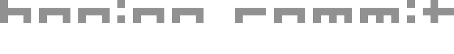

  

---

**Boring Commit** uses LLMs to generate concise Git commit messages from your staged changes.

It can work with local models or API-based providers, so you can choose between keeping everything on your machine or using a hosted model.

Written in Rust.

https://doc.rust-lang.org/beta/std/process/struct.Command.html
https://rust-cli.github.io/book/tutorial/cli-args.htmľ

https://ollama.com/download
